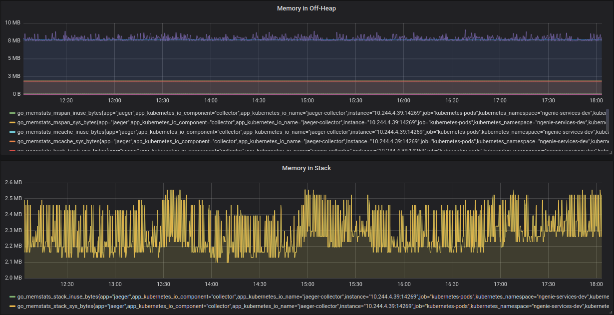
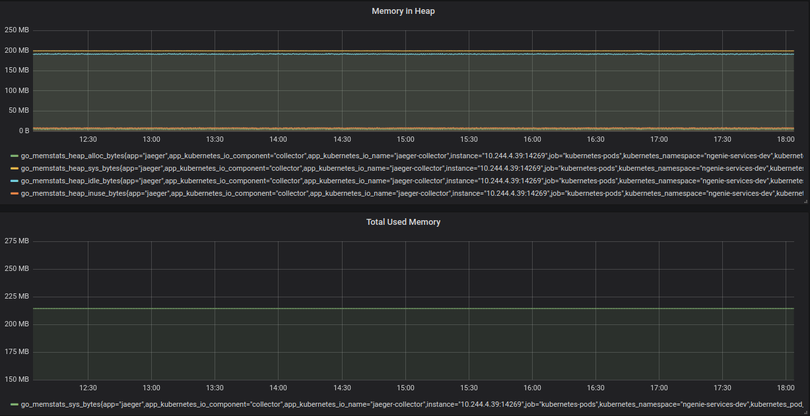
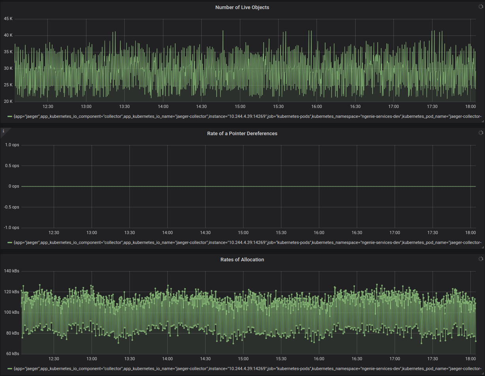
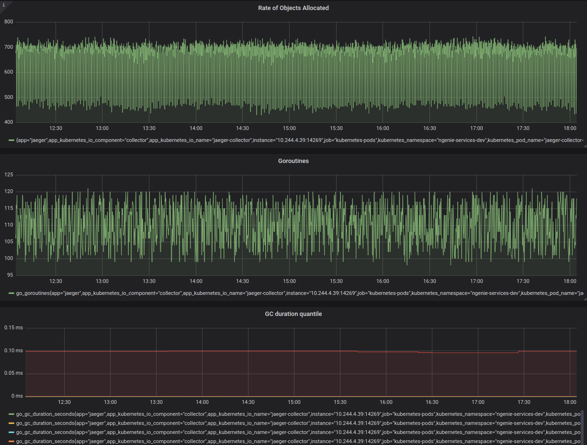

# Grafana Dashboards

Grafana dashboards are stored this repository.

## Go Metrics [#10826](https://grafana.com/grafana/dashboards/10826)

### Metrics

There are a list of metrics:

- go_goroutines
- go_gc_duration_seconds
- go_memstats_alloc_bytes
- go_memstats_heap_alloc_bytes
- go_memstats_alloc_bytes_total
- go_memstats_sys_bytes
- go_memstats_heap_alloc_bytes
- go_memstats_heap_sys_bytes
- go_memstats_heap_idle_bytes
- go_memstats_heap_inuse_bytes
- go_memstats_stack_inuse_bytes
- go_memstats_stack_sys_bytes
- go_memstats_mspan_inuse_bytes
- go_memstats_mspan_sys_bytes
- go_memstats_mcache_inuse_bytes
- go_memstats_mcache_sys_bytes
- go_memstats_buck_hash_sys_bytes
- go_memstats_gc_sys_bytes

### Dowload

[Download from Grafana Lab Marketplace](https://grafana.com/grafana/dashboards/10826)

### Screenshots

